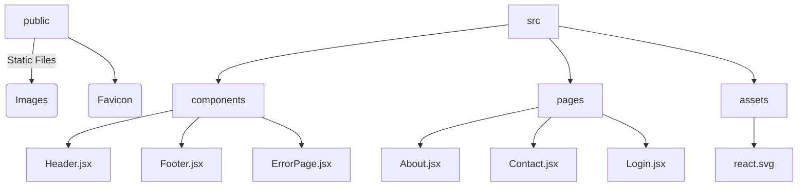

# 🎾 TennisWiki - Modern Tennis Information Hub

<div align="center">
  
[](https://reactjs.org/)
[](https://vitejs.dev/)
[](https://tailwindcss.com/)
[](https://x-neon-nexus-o.github.io/TennisWiki/)

</div>

## 🚀 Features

- 🎨 Modern, responsive UI with smooth animations
- 📱 Mobile-first design
- ⚡ Blazing fast performance with Vite
- 🎯 Interactive components with Framer Motion
- 🌐 Client-side routing with React Router

## 📦 Project Structure



## 🛠️ Tech Stack

- **Frontend Framework**: React 19
- **Build Tool**: Vite
- **Styling**: Tailwind CSS
- **Animation**: Framer Motion
- **Routing**: React Router v7
- **Deployment**: GitHub Pages

## 🚀 Getting Started

### Prerequisites

- Node.js 16+ and npm/yarn
- Git

### Installation

1. Clone the repository:
   ```bash
   git clone https://github.com/x-neon-nexus-o/TennisWiki.git
   cd frontend
   ```

2. Install dependencies:
   ```bash
   npm install
   ```

3. Start the development server:
   ```bash
   npm run dev
   ```

4. Open [http://localhost:5173](http://localhost:5173) in your browser.

## 📦 Build for Production

```bash
# Create production build
npm run build

# Preview production build
npm run preview
```

## 🚀 Deployment

The project is automatically deployed to GitHub Pages on push to the `main` branch. To deploy manually:

```bash
npm run deploy
```

## 🤝 Contributing

Contributions are welcome! Please follow these steps:

1. Fork the repository
2. Create your feature branch (`git checkout -b feature/AmazingFeature`)
3. Commit your changes (`git commit -m 'Add some AmazingFeature'`)
4. Push to the branch (`git push origin feature/AmazingFeature`)
5. Open a Pull Request

## 📄 License

This project is licensed under the MIT License - see the [LICENSE](LICENSE) file for details.

## ✨ Contributors

<a href="https://github.com/x-neon-nexus-o/TennisWiki/graphs/contributors">
  
</a>

## 💡 Features in Progress

- [ ] Player profiles
- [ ] Tournament brackets
- [ ] Live scores integration
- [ ] User authentication

<div align="center">
  


</div>
